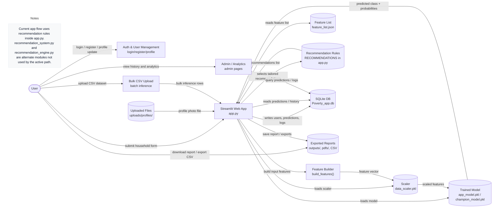

# Poverty App — Data Flow Diagram

```mermaid
flowchart LR
  %% External actor
  User([User])

  %% Frontend / App
  WebApp["Streamlit Web App\napp.py"]
  Auth["Auth & User Management\nlogin/register/profile"]
  FeatureBuilder["Feature Builder\nbuild_features()"]
  Batch["Bulk CSV Upload\nbatch inference"]
  Admin["Admin / Analytics\nadmin pages"]

  %% ML pipeline
  Model[("Trained Model\napp_model.pkl / champion_model.pkl")]
  Scaler[("Scaler\ndata_scaler.pkl")]
  FeatureList[("Feature List\nfeature_list.json")]
  Recommendations[("Recommendation Rules\nRECOMMENDATIONS in app.py")]

  %% Data stores
  DB[("SQLite DB\nPoverty_app.db")]
  Uploads[("Uploaded Files\nuploads/profiles/")]
  Outputs[("Exported Reports\noutputs/, pdfs/, CSV")]

  %% Flows
  User -->|login / register / profile update| Auth
  User -->|submit household form| WebApp
  User -->|upload CSV dataset| Batch
  User -->|download report / export CSV| Outputs
  User -->|view history and analytics| Admin

  Uploads -->|profile photo file| WebApp
  WebApp -->|writes users, predictions, logs| DB
  WebApp -->|reads predictions / history| DB
  WebApp -->|reads feature list| FeatureList
  WebApp -->|loads scaler| Scaler
  WebApp -->|loads model| Model

  WebApp -->|build input features| FeatureBuilder
  FeatureBuilder -->|feature vector| Scaler
  Scaler -->|scaled features| Model
  Model -->|predicted class + probabilities| WebApp
  WebApp -->|selects tailored recommendations| Recommendations
  Recommendations -->|recommendations list| WebApp

  WebApp -->|save report / exports| Outputs
  Batch -->|bulk inference rows| WebApp
  Admin -->|query predictions / logs| DB

  %% Notes
  subgraph Notes [Notes]
    note1["Current app flow uses recommendation rules inside app.py.\nrecommendation_system.py and recommendation_engine.py are alternate modules not used by the active path."]
  end
  style Notes fill:none,stroke:none
  note1:::note

  classDef note fill:#f8f9fa,stroke:#e2e8f0,color:#0f172a,stroke-width:1px;
```
