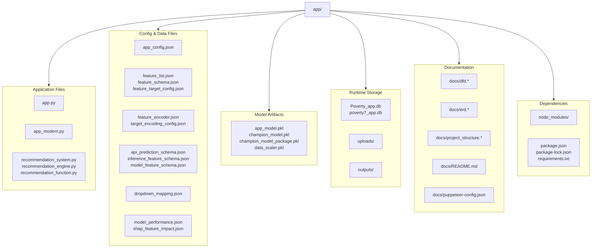

# Poverty App — Project Structure

This file contains the Mermaid source for the project structure diagram.

Notes:
- The diagram reflects the current repository organization under `e:\final year project\app`.
- `node_modules/` is included as the local dependency folder installed by npm.
- `outputs/` and `uploads/` are runtime storage folders for export artifacts and uploaded files.
